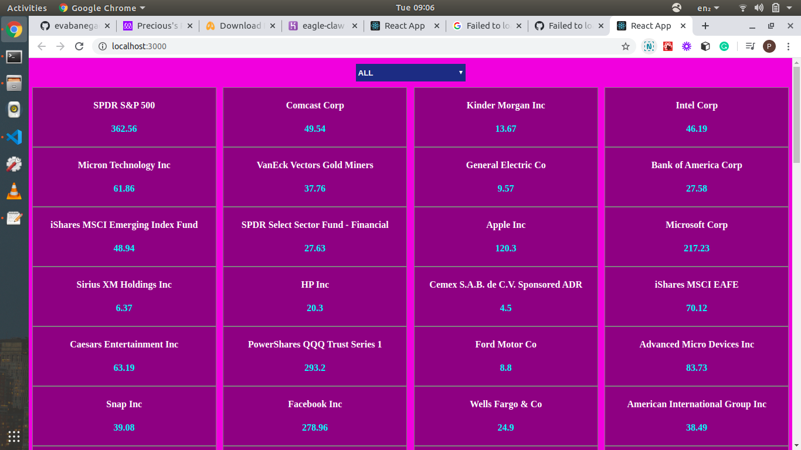

<!--
*** Thanks for checking out this README Template. If you have a suggestion that would
*** make this better, please fork the repo and create a pull request or simply open
*** an issue with the tag "enhancement".
*** Thanks again! Now go create something AMAZING! :D
-->

<!-- PROJECT SHIELDS -->
<!--
*** I'm using markdown "reference style" links for readability.
*** Reference links are enclosed in brackets [ ] instead of parentheses ( ).
*** See the bottom of this document for the declaration of the reference variables
*** for contributors-url, forks-url, etc. This is an optional, concise syntax you may use.
*** https://www.markdownguide.org/basic-syntax/#reference-style-links
-->
React-capstone -- [React-app]
This project is part of the Microverse curriculum in React&Redux module!

<br />
<p align="center">
  <a href="https://github.com/evabanegacom/React-capstone/feature">
    
  </a>

  <h3 align="center">React-capstone</h3>

<!-- TABLE OF CONTENTS -->
## Table of Contents

* [About the Project](#about-the-project)
  * [Built With](#built-with)
* [Contact](#contact)
* [Acknowledgements](#acknowledgements)
* [License](#license)

<!-- ABOUT THE PROJECT -->
## About The Project

This is React-capstone created with reactjs
<!-- INSTALLATION -->
## Installation

To have this app on your pc, you need to:
* have to enable javascript on your browser and a code editor
* [download](git@github.com:evabanegacom/React-capstone.git) or clone this repo:
  - Clone with SSH:
  ```
    git@github.com:evabanegacom/React-capstone.git
  ```
  - Clone with HTTPS
  ```
    https://github.com/evabanegacom/React-capstone.git
  ```
* Open the terminal inside the cloned directory:-

- Start the app with :
  ```
  npm start OR yarn start

  - Run test with:
  ```
  npm test

# Live Demo
- (https://eagle-claw.herokuapp.com/)

# VIDEO DEMO
- (https://youtu.be/wAl0Kw3JIo8)



### Built With
This project was built using these technologies.
* Html & css
* Javascript
* react
* Bootstrap framework
* eslint
* VsCode
<!-- CONTACT -->
## Contributors

👤 **Precious**

- GitHub: [@Precious](https://github.com/evabanegacom)

<!-- ACKNOWLEDGEMENTS -->
## Acknowledgements
* [Microverse](https://www.microverse.org/)
* [The Odin Project](https://www.theodinproject.com/)
* [Gregoire Vella] (https://www.behance.net/gregoirevella) for the design concept..